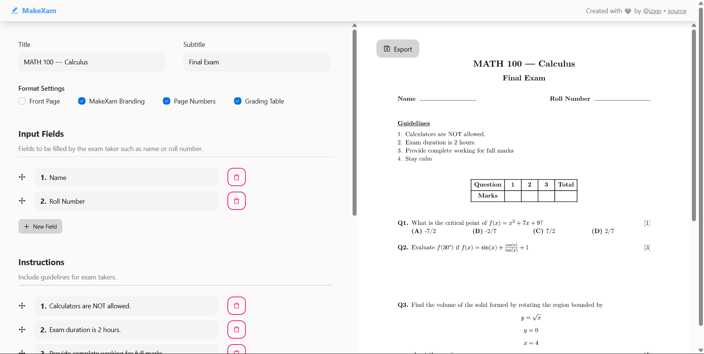

# MakeXam


[**🚀 Try MakeXam**](https://makexam.netlify.app)

MakeXam is a simple exam generation tool.

**Features**

- Simple and customizable exam layout
- Equations, codeblocks, figures, and other markup elements in questions
- Support for exporting PDF in LaTeX-like format
- Different question types including multiple choice questions
- Easily include input fields, instructions, and grading table

MakeXam is powered by [Typst](https://typst.app) for markup and PDF generation.

## Running Locally
MakeXam is written in React and uses Vite. Node 18 or higher
is required to run MakeXam.

Clone this repository and run the following command in the
cloned directory for running development build:

```
$ npm run dev
```

## Contributing
Open an issue for reporting problems or suggesting features.

For code contributions through pull requests, make sure to:

- follow standard coding conventions
- run type checker and resolve any typing issues
